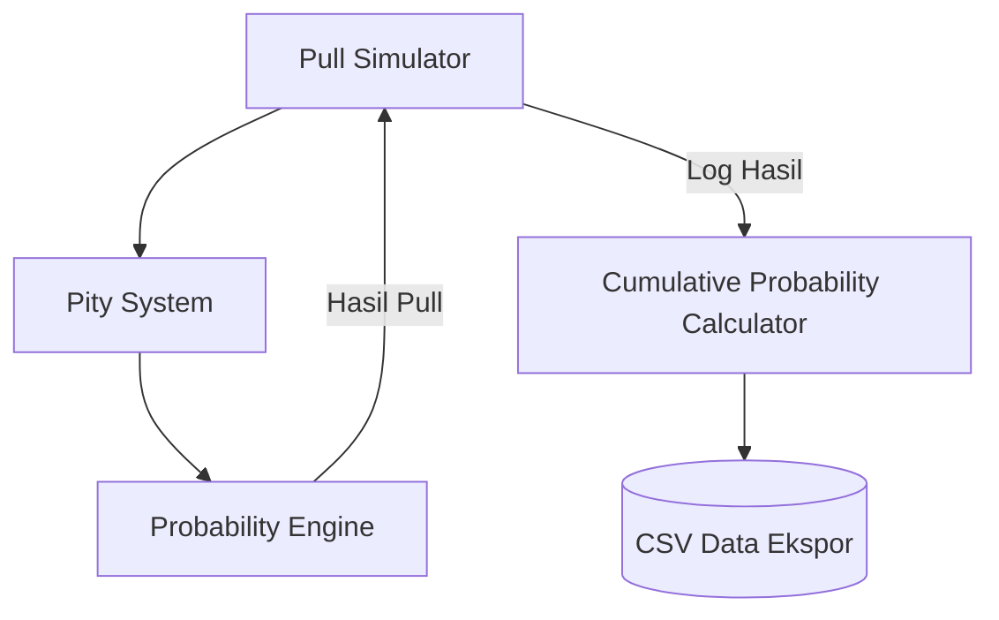
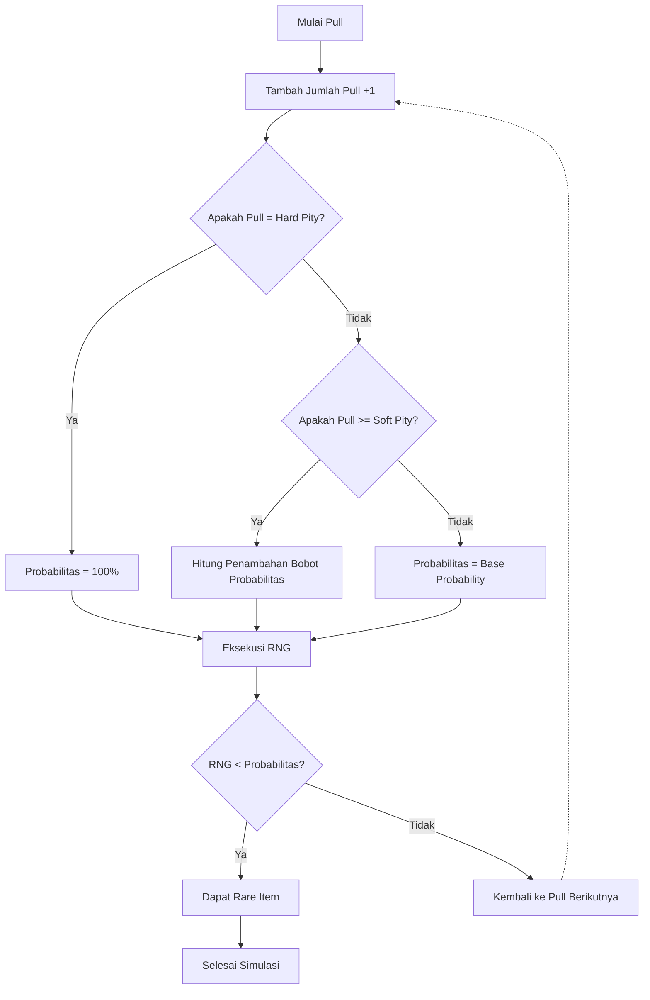

# Arsitektur dan Skema Simulasi Gacha

Dokumen ini menjelaskan arsitektur, alur logika, dan desain sistem dari purwarupa (prototype) simulasi sistem gacha yang dikembangkan untuk penelitian algoritma *weighted probability*.

## 1. Arsitektur Komponen Simulasi

Sistem simulasi dibangun atas empat komponen utama yang saling berinteraksi:
1. **Pull Simulator**: Mesin utama yang menyimulasikan pemain melakukan penarikan (*pull*) gacha.
2. **Pity System**: Komponen yang melacak jumlah penarikan yang telah dilakukan dan menentukan apakah pemain telah mencapai *soft pity* atau *hard pity*.
3. **Probability Engine**: Mesin kalkulasi probabilitas yang menentukan peluang keberhasilan (mendapatkan *rare item*) pada penarikan saat ini berdasarkan input dari *Pity System*.
4. **Cumulative Probability Calculator**: Modul statistik yang bertugas mengumpulkan data (*log*) hasil dari *Pull Simulator* dan mengkalkulasi metrik statistik, seperti *cumulative probability* dan *average pulls*.

## 2. Alur Resolusi Penarikan Gacha (Pull Logic Flow)

Berikut adalah diagram alur (flowchart) yang menunjukkan bagaimana algoritma *weighted probability* bekerja pada setiap iterasi penarikan (*pull*).

## 3. Pemetaan Skema Parameter ke Implementasi

Dalam pengujian, algoritma ini dipetakan ke dalam beberapa parameter statis dan dinamis pada implementasi kode (`05-kode/gacha.py`):

### Konfigurasi Dasar
- **`TOTAL_SAMPEL`** (100.000): Jumlah iterasi/pemain virtual dalam simulasi.
- **`BASE_PROBABILITY`** (0.006): Peluang dasar (*base rate*) sebesar 0.6%.
- **`SOFT_PITY`** (70): Titik (*pull*) ke-70 di mana algoritma *weighted probability* mulai memberikan tambahan bobot probabilitas.
- **`HARD_PITY`** (90): Batas jaminan (*pity threshold*) pada penarikan ke-90, di mana probabilitas ditetapkan secara mutlak menjadi 100% (1.0).

### Logika Kalkulasi Algoritma *Weighted Probability*
Bila jumlah pull berada pada interval *Soft Pity* dan *Hard Pity*, kalkulasi probabilitasnya menggunakan formula kenaikan persentase (linear):

`Probabilitas_Saat_Ini = Base_Probability + (Jumlah_Pull - (Soft_Pity - 1)) * (1.0 / (Hard_Pity - Soft_Pity))`

Rumus ini menjamin transisi peningkatan peluang yang seimbang setiap pull-nya, dari 0.6% di awal soft pity, menuju tepat 100% pada *hard pity*.
